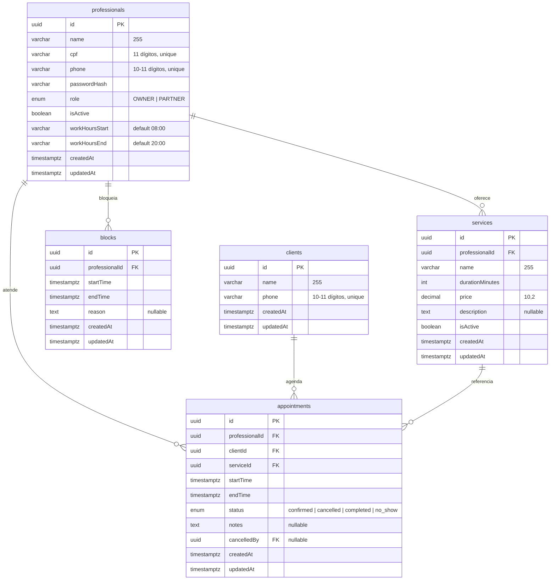

# SB-Flow — Specification

**Last Updated:** 2026-07-02
**Status:** Backend ✅ | Landing ✅ | Dashboard ⚠️ | Booking ⚠️

---

## 1. Vision

Sistema de gestão de agenda compartilhada para o Studio Blessed, onde a proprietária e as autônomas parceiras que alugam espaço visualizam a agenda umas das outras sem acesso a valores financeiros alheios, eliminando conflitos de agendamento.

**Modelo de negócio:** Autônomas parceiras que alugam espaço — não funcionárias. A proprietária gerencia os agendamentos de todas.

---

## 2. Tech Stack

| Camada | Pacote | Framework | Renderização | Status |
|--------|--------|-----------|--------------|--------|
| API | `api/` | Fastify + DrizzleORM | REST + SSE | ✅ |
| Landing | `packages/landing` | Nuxt 4 + Tailwind CSS | SSR (`/`) | ✅ |
| Dashboard | `packages/dashboard` | Nuxt 4 + Nuxt UI | SPA | ⚠️ |
| Booking | `packages/booking` | Nuxt 4 + Tailwind CSS | SPA | ⚠️ |

**Key dependencies:**
- `@nuxt/ui` v4 — componentes oficiais Nuxt (dashboard)
- `@tanstack/vue-query` — server state
- Pinia — client state (auth, UI flags)
- CASL.js — RBAC
- Zod — validação
- postgres.js `prepare: true` — driver PostgreSQL
- `@fastify/cookie` + `@fastify/cors` — auth
- SSE — tempo real (dashboard only)

---

## 3. Arquitetura de Infraestrutura

**Desenvolvimento:** Docker Compose com 2 containers (`db:5432`, `backend:3001`). Frontends executados localmente via `npm run dev:*`.

**Produção:** VPS Oracle Cloud (Always Free). GitHub Actions deploy.

**Normalização de telefone:** Armazenar apenas dígitos (DDD + número, 10-11 chars). Sem prefixo 55. Zod transform remove não-dígitos.

---

## 4. Domínios e Pacotes

### 4.1 Landing (`packages/landing`) ✅

| Rota | Descrição | Status |
|------|-----------|--------|
| `/` | Home institucional (SSR) | ✅ Completo |

### 4.2 Dashboard (`packages/dashboard`) ⚠️

| Rota | Descrição | Auth | Status |
|------|-----------|------|--------|
| `/login` | Login profissional | - | ✅ |
| `/dashboard/` | Painel inicial | Cookie | ⚠️ Placeholder |
| `/dashboard/agenda` | Agenda do dia | Cookie | ⚠️ Placeholder |
| `/dashboard/clientes` | CRUD de clientes | Cookie | ⚠️ Placeholder |
| `/dashboard/profissionais` | CRUD de profissionais | OWNER | ⚠️ Placeholder |
| `/dashboard/servicos` | CRUD de serviços | Cookie | ⚠️ Placeholder |

### 4.3 Booking (`packages/booking`) ⚠️

| Rota | Descrição | Auth | Status |
|------|-----------|------|--------|
| `/` | Agendamento multi-step | Público | ⚠️ Placeholder |

---

## 5. Modelo de Dados



**Status:** ✅ Implementado

---

## 6. Autenticação e Autorização

### 6.1 Auth

- Login: telefone + senha (sem email)
- Tokens: `access_token` (15 min) + `refresh_token` (30 dias)
- Cookies HttpOnly, SameSite=Lax, Secure em prod
- Refresh automático via interceptor Nuxt

**Status:** ✅ Implementado

### 6.2 RBAC (CASL.js)

**OWNER:** `can('manage', 'all')`

**PARTNER:**
- Appointment: `read` (todas, sem valor); `create/update/cancel/setStatus` (só próprios)
- Client: `read` (todas)
- Service: `create/read/update/delete` (só próprios)
- Professional: `read/update` (só próprio)
- Block: `create/read/delete` (só próprio)

**Regra de visibilidade:** Valor financeiro oculto quando PARTNER vê appointment de outra profissional.

---

## 7. API Endpoints

**Status:** ✅ Backend completo — **14 modules implementados**

### Authentication ✅

| Method | Path | Auth | Response |
|--------|------|------|----------|
| POST | `/api/auth/login` | No | Set cookies + `{ user }` |
| POST | `/api/auth/refresh` | Cookie | New cookies |
| POST | `/api/auth/logout` | Cookie | Clear cookies |

### Professionals ✅

| Method | Path | Role | Body |
|--------|------|------|------|
| GET | `/api/professionals` | OWNER/PARTNER | - |
| POST | `/api/professionals` | OWNER | `{ name, cpf, phone, password, role }` |
| PUT | `/api/professionals/:id` | OWNER (any) / PARTNER (own) | fields |
| PATCH | `/api/professionals/:id/toggle-active` | OWNER | - |

### Services ✅

| Method | Path | Role |
|--------|------|------|
| GET | `/api/services?professional_id=` | filtered |
| POST | `/api/services` | OWNER (any) / PARTNER (own) |
| PUT | `/api/services/:id` | OWNER (any) / PARTNER (own) |
| DELETE | `/api/services/:id` | soft delete if has appointments |

**Regra de UI no Dashboard:**
- OWNER: campo seletor de profissional para gerenciar serviços de qualquer profissional
- PARTNER: campo fixo na profissional logada (sem opção de trocar)

### Clients ✅

| Method | Path | Role |
|--------|------|------|
| GET | `/api/clients?q=` | OWNER/PARTNER |
| POST | `/api/clients` | OWNER |
| PUT | `/api/clients/:id` | OWNER |
| GET | `/api/clients/:id/history` | OWNER (all) / PARTNER (own) |

### Appointments ✅

| Method | Path | Role |
|--------|------|------|
| GET | `/api/appointments?professional_id=&start=&end=` | OWNER/PARTNER |
| POST | `/api/appointments` | transaction check |
| PUT | `/api/appointments/:id` | edit restrictions |
| PATCH | `/api/appointments/:id/cancel` | OWNER/PARTNER |
| PATCH | `/api/appointments/:id/status` | completed/no_show |

### Blocks ✅

| Method | Path | Role |
|--------|------|------|
| GET | `/api/blocks?professional_id=&start=&end=` | OWNER/PARTNER |
| POST | `/api/blocks` | OWNER/PARTNER |
| DELETE | `/api/blocks/:id` | OWNER/PARTNER |

### SSE ✅

| Method | Path | Auth |
|--------|------|------|
| GET | `/api/sse` | Cookie |

### Booking (Público) ✅

| Method | Path | Body | Notes |
|--------|------|------|-------|
| GET | `/api/booking/professionals` | - | isActive=true |
| GET | `/api/booking/professionals/:id/services` | - | isActive=true |
| GET | `/api/booking/professionals/:id/slots?date=` | - | Slots 30min, exclui bookings e blocks |
| POST | `/api/booking/appointments` | `{ professionalId, serviceId, startTime, phone, clientName? }` | cria cliente se novo |
| GET | `/api/booking/appointments?phone=` | - | lista futuros do cliente |
| POST | `/api/booking/appointments/:id/cancel` | `{ phone }` | valida phone + startTime > now |

**Documentação completa:** `.specs/API.md`

---

## 8. Regras de Negócio

### 8.1 Conflito de Horário

- Criação de appointment usa `db.transaction()` com SELECT + INSERT atômico
- Conflito retorna 409 com sugestões de horários alternativos
- Bloqueios impedem agendamento no período

### 8.2 Cancelamento

- Agendamento passado: mantém horário ocupado (status = cancelled)
- Agendamento futuro: libera horário
- Status `cancelled` não pode ser alterado

### 8.3 Edição

- Agendamento passado (startTime < now): 422, permite apenas alteração de status
- Agendamento futuro: permite edição completa

### 8.4 Visibilidade Financeira

- PARTNER vê valor apenas dos próprios appointments
- Valor de outras profissionais exibido como "não informado"
- OWNER vê todos os valores

### 8.5 Autoatendimento (Booking)

- Cliente informa telefone diretamente (sem verificação WhatsApp)
- Cliente pode agendar sem conta
- Cliente pode cancelar próprios agendamentos futuros (via telefone)
- Telefone errado: proprietária corrige no dashboard

---

## 9. Tempo Real (SSE) ✅

- Endpoint: `GET /api/sse` (autenticado via cookie)
- Eventos: `appointment:created`, `appointment:updated`, `appointment:cancelled`, `appointment:status-changed`, `block:created`, `block:deleted`
- OWNER recebe eventos de todas; PARTNER recebe dos próprias
- Heartbeat a cada 30s
- Reconexão automática com backoff

**Booking é REST puro** — cliente não usa SSE.

---

## 10. Estado no Frontend

### Pinia (Client State) ✅

- `useAuthStore`: `user`, `isAuthenticated`, `role`, `login()`, `logout()`, `refreshToken()`
- `useLayoutStore`: `isSidebarOpen`, `toggleSidebar()` — usa `useLocalStorage`

### TanStack Query (Server State) ✅

- Composables por domínio: `useAppointments`, `useClients`, `useServices`, `useProfessionals`
- Query keys: `["appointments", "list", date]`, `["clients", id]`
- Mutations invalidam queries relacionadas

---

## 11. Seed ✅

Script cria apenas conta OWNER (admin) via variáveis de ambiente (`SEED_ADMIN_NAME`, `SEED_ADMIN_PHONE`, `SEED_ADMIN_CPF`, `SEED_ADMIN_PASSWORD`).

---

## 12. Out of Scope (v1)

- Bot WhatsApp conversacional
- Relatórios para extração
- Pagamento online
- Notificações push/SMS
- App mobile nativo
- Controle de estoque

---

## 13. Arquitetura DDD (Dashboard)

```
packages/dashboard/app/
├── features/
│   ├── auth/              # stores, middleware, pages/login ✅
│   ├── clients/           # composables ✅, pages ⚠️
│   ├── appointments/     # composables ✅, pages ⚠️
│   ├── treatments/        # composables ✅, pages ⚠️
│   ├── professionals/    # pages ⚠️
│   └── dashboard/         # layouts ✅, pages ⚠️
└── shared/
    ├── composables/       # use-sse ✅, use-user-profile ✅
    ├── stores/           # layout ✅
    ├── utils/            # api ✅, phone ✅
    └── plugins/          # vue-query ✅
```

---

## 14. Implementation Status

### ✅ Implementado

| Componente | Status | Notas |
|-----------|--------|-------|
| Backend API | 100% | 7 modules: auth, appointments, booking, clients, partner, services, sse |
| Landing Page | 100% | 11 seções SSR, carrossel, fotos, Nuxt 4 |
| Dashboard DDD Structure | 100% | features/ + shared/ criados |
| Auth Flow | 100% | login, refresh, middleware, store |
| TanStack Query Setup | 100% | composables, plugins, hydration |
| SSE | 100% | endpoint + client composable |

### ⚠️ Pendente — Dashboard

| Task | Descrição | Prioridade |
|------|-----------|------------|
| DASHBOARD-03 | Layout com sidebar collapsible + navegação | ✅ Concluído (20 testes) |
| DASHBOARD-04 | Dashboard index com KPIs reais | Alta |
| — | Página `/dashboard/agenda` — calendário funcional | Alta |
| — | Página `/dashboard/clientes` — CRUD | Alta |
| — | Página `/dashboard/profissionais` — CRUD | Alta |
| — | Página `/dashboard/servicos` — CRUD | Alta |

### ⚠️ Pendente — Booking

| Task | Descrição | Prioridade |
|------|-----------|------------|
| — | Fluxo multi-step: selecionar profissional → serviço → horário → confirmar | Alta |
| — | "Meus Agendamentos": cliente consulta/cancela por telefone | Alta |

**Ver tasks detalhadas:** `.specs/features/dashboard/tasks.md`

---

## 15. Next Steps (Execução)

```
IMEDIATO:
  1. DASHBOARD-03: Layout com sidebar + navegação
  2. DASHBOARD-04: Dashboard index com KPIs reais

CURTO PRAZO:
  3. Booking: Fluxo multi-step completo
  4. Páginas: agenda, clientes, profissionais, servicos

MÉDIO PRAZO:
  5. T1-T12: DDD Restructuring (migração completa do dashboard)
  6. Meus Agendamentos (cliente)
```