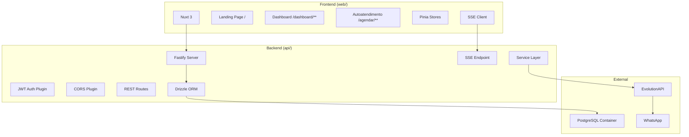
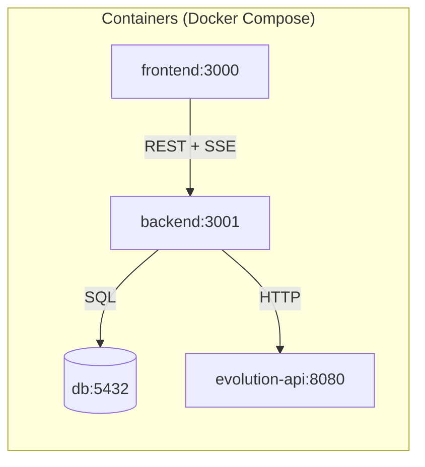
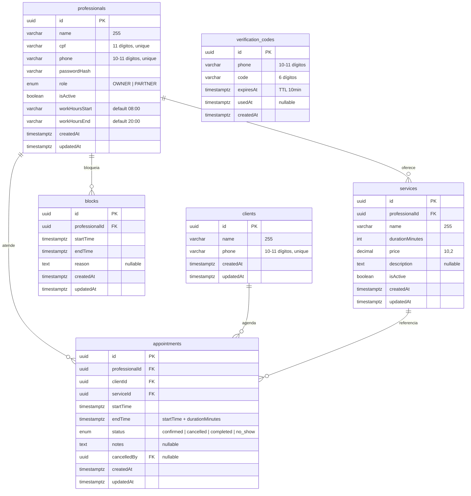
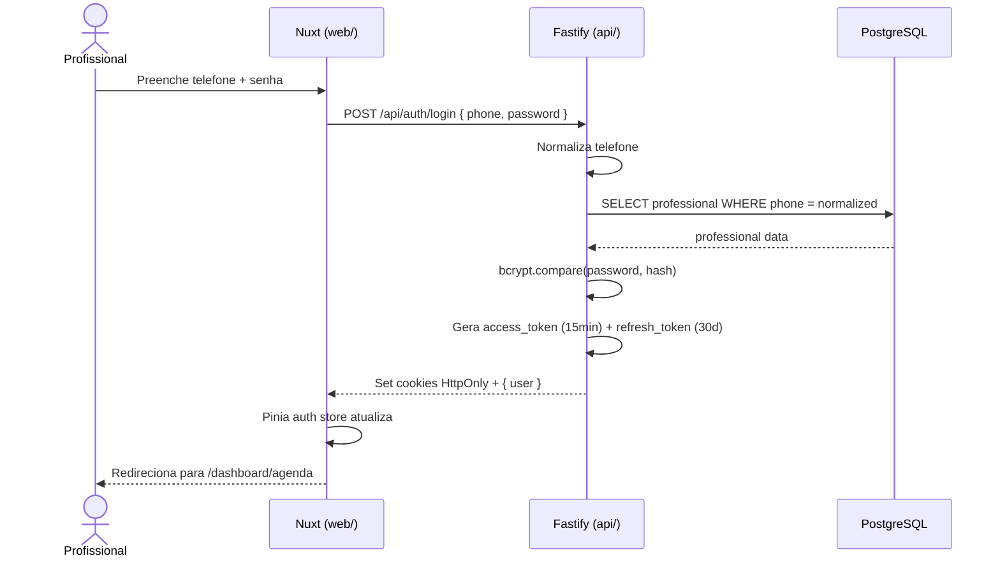
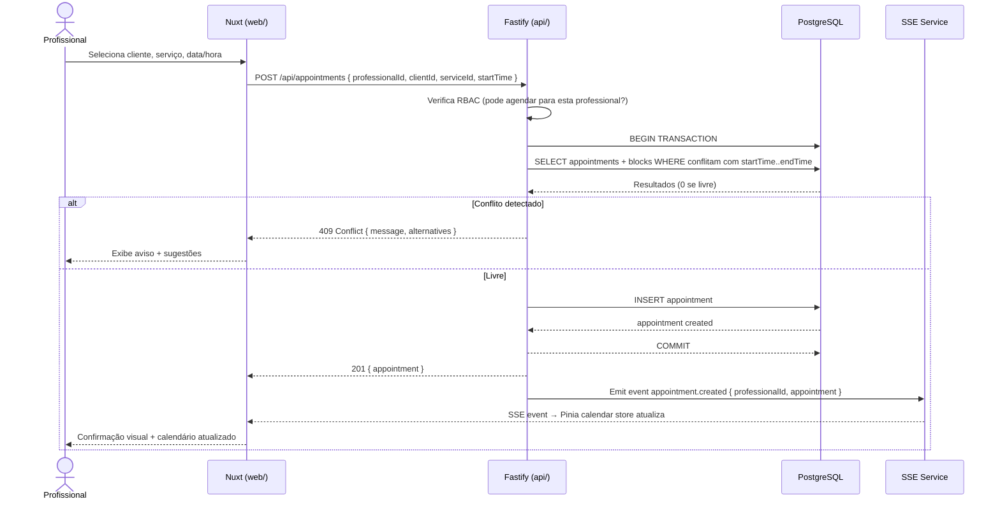
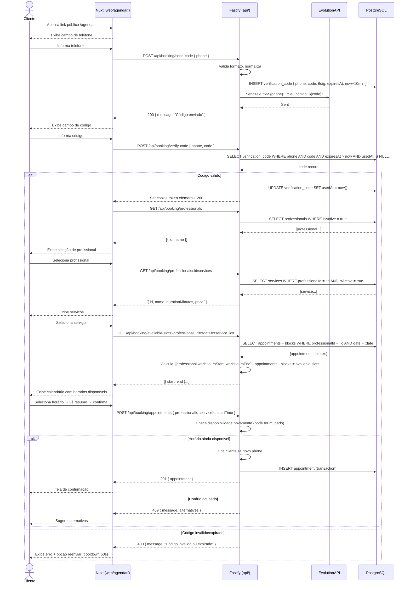
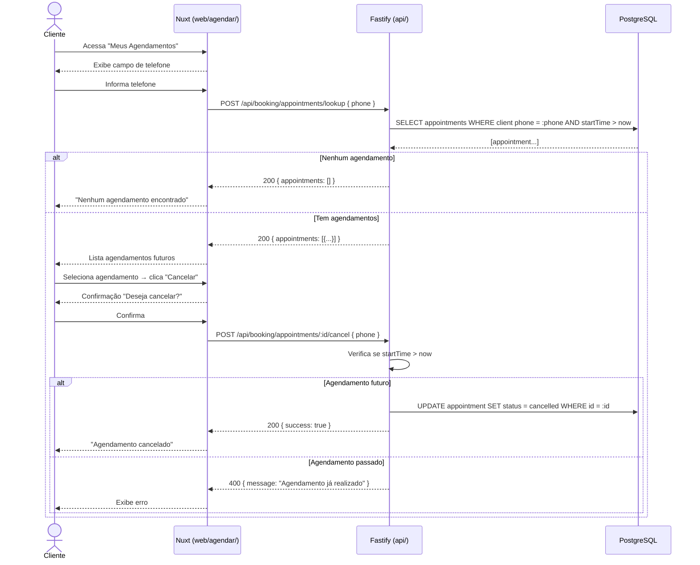
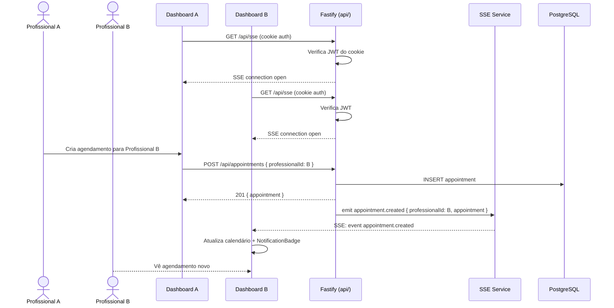

# Agenda Compartilhada — Design

**Spec**: `.specs/features/agenda-compartilhada/spec.md`
**Status**: Draft

---

## Architecture Overview

Monorepo com `api/` (Fastify) e `web/` (Nuxt 3). Comunicação via REST + SSE. Banco PostgreSQL em container Docker.





---

## Modelo Entidade-Relacionamento (MER)



---

## Diagramas de Sequência (UML)

### Fluxo de Login (Profissional)



### Criação de Agendamento (Profissional)



### Fluxo de Autoatendimento (Cliente)



### Cliente Vê e Cancela Agendamentos



### Atualização em Tempo Real (SSE)



---

## Data Models

### professionals

```typescript
interface Professional {
  id: string // UUID
  name: string
  cpf: string // 11 digits, unique
  phone: string // 10-11 digits, no 55 prefix, unique
  passwordHash: string
  role: 'OWNER' | 'PARTNER'
  isActive: boolean
  workHoursStart: string // '08:00' default — HH:mm, horário inicial da janela de agendamento
  workHoursEnd: string // '20:00' default — HH:mm, horário final da janela de agendamento
  createdAt: Date
  updatedAt: Date
}
```

### services

```typescript
interface Service {
  id: string // UUID
  professionalId: string // FK → professionals
  name: string
  durationMinutes: number
  price: number // DECIMAL(10,2)
  description: string | null
  isActive: boolean
  createdAt: Date
  updatedAt: Date
}
```

### clients

```typescript
interface Client {
  id: string // UUID
  name: string
  phone: string // 10-11 digits, unique
  createdAt: Date
  updatedAt: Date
}
```

### appointments

```typescript
interface Appointment {
  id: string // UUID
  professionalId: string // FK → professionals
  clientId: string // FK → clients
  serviceId: string // FK → services
  startTime: Date
  endTime: Date // computed: startTime + service.durationMinutes
  status: 'confirmed' | 'cancelled' | 'completed' | 'no_show'
  notes: string | null
  cancelledBy: string | null // FK → professionals
  createdAt: Date
  updatedAt: Date
}
```

### blocks

```typescript
interface Block {
  id: string // UUID
  professionalId: string // FK → professionals
  startTime: Date
  endTime: Date
  reason: string | null
  createdAt: Date
  updatedAt: Date
}
```

### verification_codes

```typescript
interface VerificationCode {
  id: string // UUID
  phone: string // 10-11 digits
  code: string // 6 digits
  expiresAt: Date // TTL 10 minutes
  usedAt: Date | null
  createdAt: Date
}
```

---

## Component Breakdown

### Backend — Modules

Cada módulo segue o padrão: `routes.ts` + `service.ts` + `schema.ts` (Zod).

#### auth
- **Purpose**: Autenticação de profissionais (telefone + senha), refresh token, logout
- **Location**: `api/src/modules/auth/`
- **Routes**: `POST /api/auth/login`, `POST /api/auth/refresh`, `POST /api/auth/logout`
- **Dependencies**: JWT plugin, professionals service
- **Key decisions**:
  - `access_token` 15 min, `refresh_token` 30 dias
  - Cookies HttpOnly, SameSite=Lax, Secure em prod
  - Refresh silencioso via Nuxt plugin interceptor

#### professionals
- **Purpose**: CRUD de profissionais (OWNER gerencia todas; PARTNER vê apenas a si)
- **Location**: `api/src/modules/professionals/`
- **Routes**: `GET /api/professionals`, `POST /api/professionals`, `PUT /api/professionals/:id`, `PATCH /api/professionals/:id/toggle-active`
- **Editable fields via PUT**: `name`, `phone`, `password`, `workHoursStart`, `workHoursEnd` (PARTNER edita apenas próprios; OWNER edita qualquer)
- **Dependencies**: RBAC middleware (CASL.js)

#### services
- **Purpose**: CRUD de serviços por profissional
- **Location**: `api/src/modules/services/`
- **Routes**: `GET /api/services`, `POST /api/services`, `PUT /api/services/:id`, `DELETE /api/services/:id`
- **Dependencies**: RBAC middleware
- **Reuses**: Same CRUD pattern as professionals

#### clients
- **Purpose**: Cadastro e busca de clientes (compartilhado entre todas)
- **Location**: `api/src/modules/clients/`
- **Routes**: `GET /api/clients?q=`, `POST /api/clients`, `PUT /api/clients/:id`, `GET /api/clients/:id/history`
- **RBAC**: PARTNER pode apenas **ler** clientes; criação/edição apenas OWNER
- **Dependencies**: Phone normalization utility

#### appointments
- **Purpose**: CRUD de agendamentos com checagem de conflito em transação
- **Location**: `api/src/modules/appointments/`
- **Routes**: `GET /api/appointments`, `POST /api/appointments`, `PUT /api/appointments/:id`, `PATCH /api/appointments/:id/cancel`, `PATCH /api/appointments/:id/status`
- **Dependencies**: Professionals, Clients, Services modules; SSE event emitter
- **Key decisions**:
  - `createAppointment()` usa `db.transaction()` — SELECT verifica disponibilidade, INSERT se livre, rollback se conflito → 409
  - `endTime` é `startTime + service.durationMinutes` (calculado no backend, não recebido do frontend)
  - Cancelamento em horário passado: mantém horário ocupado (não reabre)
  - **Validação EDGE-07**: `PUT /api/appointments/:id` verifica se `startTime < now`. Se passado, retorna 422 e permite apenas `PATCH /api/appointments/:id/status`. Edit check também no frontend (desabilitar campos)

#### blocks
- **Purpose**: Bloqueio de horários na agenda
- **Location**: `api/src/modules/blocks/`
- **Routes**: `GET /api/blocks`, `POST /api/blocks`, `DELETE /api/blocks/:id`
- **Dependencies**: SSE event emitter
- **Key decisions**:
  - Bloqueios impedem criação de agendamentos (checagem na transação)
  - Bloqueio pode ser de dia inteiro (00:00-23:45)
  - Não usa soft delete — remover bloqueio é DELETE real
  - **Validação EDGE-03**: ao criar bloco, service verifica se há appointments `status != 'cancelled'` no período. Se houver, retorna aviso `{ warning: "Há agendamentos neste período", conflictingAppointments: [...] }` mas **não bloqueia** a criação — profissionais podem bloquear mesmo com agendamentos (ex: emergência)
  - Para PARTNER, a checagem considera apenas appointments da própria; para OWNER, de qualquer profissional

#### booking (autoatendimento)
- **Purpose**: Fluxo público de agendamento pelo cliente (prefixo `/api/booking/*`)
- **Location**: `api/src/modules/booking/`
- **Routes**:
  - `POST /api/booking/send-code`
  - `POST /api/booking/verify-code`
  - `GET /api/booking/professionals` — filtro `isActive = true`
  - `GET /api/booking/professionals/:id/services` — filtro `isActive = true`
  - `GET /api/booking/available-slots?professional_id=&date=&service_id=` (service_id **obrigatório** — necessário para calcular durationMinutes e determinar slots disponíveis)
  - `POST /api/booking/appointments`
  - `GET /api/booking/appointments`
  - `POST /api/booking/appointments/:id/cancel` `{ phone }`
- **Dependencies**: Verification codes, EvolutionAPI, Appointments service
- **Key decisions**:
  - **Booking flow** (agendar novo): EvolutionAPI send-text, código 6 dígitos, TTL 10 min, cooldown 60s. Token efêmero em cookie para fluxo multi-step.
  - **View/Cancel flow** (ver/cancelar próprios): apenas telefone, sem código de verificação. Sistema busca pelo telefone e exibe agendamentos. Se telefone errado, cliente pode editar o cadastro (corrigir telefone).
  - Available slots calcula: `[professional.workHoursStart]` - `[professional.workHoursEnd]` - appointments ocupados - blocks. Profissionais ajustam `workHoursStart`/`workHoursEnd` para aumentar ou diminuir a janela, e usam bloqueios para ocupar manhãs, tardes ou dias inteiros.
  - `POST /api/booking/appointments` cria cliente automaticamente se telefone for novo (busca por phone, cria se não existir)
  - Confirmação final checa disponibilidade novamente (pode ter mudado) → 409 se ocupado, sugere alternativas

#### sse
- **Purpose**: Gerenciar conexões SSE e emitir eventos em tempo real
- **Location**: `api/src/modules/sse/sse.service.ts`
- **Events**:
  - `appointment.created` | `appointment.updated` | `appointment.cancelled`
  - `block.created` | `block.deleted`
- **Dependencies**: @fastify/cookie (autenticação via cookie)

### Seed (Setup Inicial)

- **Script**: `api/src/db/seed.ts` — executado na primeira migração via `drizzle-kit` ou script npm separado
- **Cria apenas**: conta OWNER do administrador do sistema (você) com dados vindos de variáveis de ambiente (`SEED_ADMIN_NAME`, `SEED_ADMIN_PHONE`, `SEED_ADMIN_CPF`, `SEED_ADMIN_PASSWORD`)
- **Fluxo**: você loga como Administrador → cadastra a dona do salão como OWNER → a dona cadastra parceiras, serviços e clientes pelo sistema

### Backend — Shared

#### rbac.ts
- **Purpose**: Fábrica de abilities CASL.js para cada role
- **Location**: `api/src/shared/rbac.ts`
- **Reuses**: CASL.js `AbilityBuilder`
- **Key rules**:
  - OWNER: `can('manage', 'all')`
  - PARTNER:
    - Agenda: `can('read', 'Appointment')` sem restrição (vê horários ocupados); `can(['read', 'create', 'update', 'cancel', 'setStatus'], 'Appointment', { professionalId: ownId })` (só nos próprios); valor financeiro ocultado no service layer se `professionalId !== ownId`
    - Clientes: `can('read', 'Client')` (só leitura); criação/edição apenas OWNER
    - Serviços: `can(['read', 'create', 'update', 'delete'], 'Service', { professionalId: ownId })`
    - Profissionais: `can('read', 'Professional', { id: ownId })`; `can('update', 'Professional', { id: ownId })` (nome, telefone, workHours)
    - Bloqueios: `can(['read', 'create', 'delete'], 'Block', { professionalId: ownId })`

#### phone.ts
- **Purpose**: Normalização de telefone (Zod transform + utilities)
- **Location**: `api/src/shared/phone.ts`

#### errors.ts
- **Purpose**: Classes de erro customizadas
- **Location**: `api/src/shared/errors.ts`
- **Classes**: `ConflictError` (409), `NotFoundError` (404), `ForbiddenError` (403), `ValidationError` (400)

### Frontend — Pages

| Page | Route | Type | Purpose |
|------|-------|------|---------|
| `index.vue` | `/` | SSR | Landing page do Studio Blessed |
| `login.vue` | `/login` | SPA | Login profissional |
| `dashboard/agenda.vue` | `/dashboard/agenda` | SPA | Calendário semanal |
| `dashboard/clientes.vue` | `/dashboard/clientes` | SPA | Gestão de clientes |
| `dashboard/servicos.vue` | `/dashboard/servicos` | SPA | Gestão de serviços |
| `dashboard/financeiro.vue` | `/dashboard/financeiro` | SPA | Financeiro (OWNER only) |
| `agendar/index.vue` | `/agendar` | SPA | Autoatendimento: telefone |
| Other agendar pages | `/agendar/**` | SPA | Fluxo multi-step |

### Frontend — Components Core

#### WeeklyCalendar
- **Purpose**: Calendário semanal visual com slots de 15 min, similar Google Agenda
- **Props**: `appointments`, `blocks`, `professionalFilter`, `onSlotClick`, `onEventClick`
- **Reuses**: Vuetify `v-calendar` nativo

#### AppointmentForm
- **Purpose**: Modal de criação/edição de agendamento
- **Fields**: Cliente (search autocomplete + quick create), Serviço (dropdown), Profissional (se OWNER), Data/Hora (time picker)
- **Validation**: Zod schema no frontend, envia para API

#### ClientSearch
- **Purpose**: Autocomplete de busca de clientes por nome ou telefone
- **Behavior**: Debounce 300ms, busca na API, opção "Novo cliente" se não encontrado

#### PhoneInput
- **Purpose**: Input de telefone com máscara visual
- **Behavior**: Exibe (XX) XXXXX-XXXX para 11 dígitos, (XX) XXXX-XXXX para 10

#### NotificationBadge
- **Purpose**: Badge no dashboard indicando novos eventos SSE
- **Data**: Consome `notifications` Pinia store populada por SSE

#### ConfirmDialog
- **Purpose**: Diálogo de confirmação reutilizável
- **Props**: `title`, `message`, `confirmText`, `cancelText`, `onConfirm`

### Frontend — Composable / Stores

#### useAuth (composable + Pinia store)
- **State**: `user`, `isAuthenticated`, `role`
- **Actions**: `login()`, `logout()`, `refreshToken()`
- **Plugin**: Intercepta 401, chama refresh, repete requisição

#### useCalendar (composable + Pinia store)
- **State**: `currentWeekStart`, `appointments`, `blocks`, `professionalFilter`
- **Actions**: `navigateWeek()`, `fetchWeek()`, `createAppointment()`, etc.

#### useSSE (composable)
- **Behavior**: Connect `EventSource` → dispatch events to stores → reconnect on close
- **Auth**: Cookie-based (EventSource doesn't send headers)

#### self-service store (Pinia)
- **State**: `step`, `phone`, `verified`, `selectedProfessional`, `selectedService`, `selectedSlot`
- **Actions**: `sendCode()`, `verifyCode()`, `confirmAppointment()`

---

## API Endpoints

### Authentication

| Method | Path | Auth | Role | Body | Response |
|--------|------|------|------|------|----------|
| POST | `/api/auth/login` | No | - | `{ phone, password }` | Set cookies, `{ user }` |
| POST | `/api/auth/refresh` | Cookie | OWNER/PARTNER | - | Set new cookies |
| POST | `/api/auth/logout` | Cookie | OWNER/PARTNER | - | Clear cookies |

### Professionals

| Method | Path | Auth | Role |
|--------|------|------|------|
| GET | `/api/professionals` | Cookie | OWNER (all), PARTNER (own) |
| POST | `/api/professionals` | Cookie | OWNER only |
| PUT | `/api/professionals/:id` | Cookie | OWNER only |
| PATCH | `/api/professionals/:id/toggle-active` | Cookie | OWNER only |

### Services

| Method | Path | Auth | Role |
|--------|------|------|------|
| GET | `/api/services?professional_id=` | Cookie | OWNER/PARTNER (filtered) |
| POST | `/api/services` | Cookie | OWNER (any), PARTNER (own) |
| PUT | `/api/services/:id` | Cookie | OWNER (any), PARTNER (own) |
| DELETE | `/api/services/:id` | Cookie | OWNER (any), PARTNER (own) |

### Clients

| Method | Path | Auth | Role |
|--------|------|------|------|
| GET | `/api/clients?q=` | Cookie | OWNER/PARTNER |
| POST | `/api/clients` | Cookie | OWNER only |
| PUT | `/api/clients/:id` | Cookie | OWNER only |
| GET | `/api/clients/:id/history` | Cookie | OWNER (all appointments), PARTNER (own appointments only) |

### Appointments

| Method | Path | Auth | Role |
|--------|------|------|------|
| GET | `/api/appointments?professional_id=&start=&end=` | Cookie | OWNER/PARTNER |
| POST | `/api/appointments` | Cookie | OWNER (any), PARTNER (own) |
| PUT | `/api/appointments/:id` | Cookie | OWNER (any), PARTNER (own) |
| PATCH | `/api/appointments/:id/cancel` | Cookie | OWNER (any), PARTNER (own) |
| PATCH | `/api/appointments/:id/status` | Cookie | OWNER (any), PARTNER (own) |

### Blocks

| Method | Path | Auth | Role |
|--------|------|------|------|
| GET | `/api/blocks?professional_id=&start=&end=` | Cookie | OWNER/PARTNER |
| POST | `/api/blocks` | Cookie | OWNER (any), PARTNER (own) |
| DELETE | `/api/blocks/:id` | Cookie | OWNER (any), PARTNER (own) |

### SSE

| Method | Path | Auth | Role |
|--------|------|------|------|
| GET | `/api/sse` | Cookie | OWNER/PARTNER |

### Booking (Public) — `/api/booking/*`

| Method | Path | Auth | Notes |
|--------|------|------|-------|
| POST | `/api/booking/send-code` | No | Booking flow |
| POST | `/api/booking/verify-code` | No | Booking flow |
| GET | `/api/booking/professionals` | No | |
| GET | `/api/booking/professionals/:id/services` | No | |
| GET | `/api/booking/available-slots` | No | |
| POST | `/api/booking/appointments` | Token* | Booking flow |
| POST | `/api/booking/appointments/lookup` | No | View/cancel flow: `{ phone }` → lista agendamentos do cliente |
| POST | `/api/booking/appointments/:id/cancel` | No | View/cancel flow: `{ phone }` → cancela |

\* *Token = efêmero em cookie, emitido após verify-code no booking flow*

**View/Cancel flow não exige verificação**: cliente digita telefone, sistema busca pelo número e exibe agendamentos. Se digitou errado, apenas a **proprietária (OWNER)** ou **administrador do sistema** pode corrigir o telefone no cadastro da cliente — a cliente não altera o próprio telefone.

---

## Error Handling Strategy

| Error Scenario | Handling | HTTP | User Impact |
|---------------|----------|------|-------------|
| Conflito de horário | Rollback transação + sugestão de alternativas | 409 | "Horário ocupado. Sugestões: [alternativas]" |
| Profissional não encontrada | NotFoundError | 404 | "Profissional não encontrada" |
| Serviço não encontrado | NotFoundError | 404 | "Serviço não encontrado" |
| Cliente não encontrado | NotFoundError | 404 | "Cliente não encontrado" |
| RBAC violation | ForbiddenError | 403 | "Você não tem permissão para esta ação" |
| Validação Zod | ValidationError | 400 | Erro específico do campo |
| Token expirado | JWT plugin | 401 | Refresh automático via interceptor |
| EvolutionAPI offline | Log + fallback | 503 | "Serviço temporariamente indisponível" |

---

## Requirement Traceability

### P1 — MVP (must ship)

| Req ID | Story | Acceptance Criteria | Design Coverage | Status |
|--------|-------|--------------------|-----------------|--------|
| AUTH-01 | Autenticação | Login phone+password → dashboard | Auth module: `POST /api/auth/login` + JWT cookies | ✅ |
| AUTH-02 | Autenticação | Credenciais inválidas → erro genérico | Auth module valida + `ValidationError` | ✅ |
| AUTH-03 | Autenticação | OWNER → seletor de profissional | RBAC + `professionalFilter` no WeeklyCalendar | ✅ |
| AUTH-04 | Autenticação | PARTNER → fixa na própria agenda | RBAC + `professionalFilter` bloqueado | ✅ |
| AGENDA-01 | Visualização | Calendário semanal 15min | `WeeklyCalendar` com Vuetify v-calendar | ✅ |
| AGENDA-02 | Visualização | OWNER "Todas" → cores distintas | `professionalFilter` prop + cor por profissional | ✅ |
| AGENDA-03 | Visualização | OWNER filtro específico | `professionalFilter` prop | ✅ |
| AGENDA-04 | Visualização | PARTNER → só própria | RBAC filtra no fetch + frontend | ✅ |
| AGENDA-05 | Visualização | Valor oculto de outras | Service layer omite `price` se `professionalId !== ownId` | ✅ |
| AGENDA-06 | Visualização | Valor próprio visível | Service layer inclui `price` se `professionalId === ownId` | ✅ |
| AGEND-01 | Criação | OWNER → qualquer profissional | RBAC + `AppointmentForm` com seletor de profissional | ✅ |
| AGEND-02 | Criação | PARTNER → só própria | RBAC + `AppointmentForm` sem seletor | ✅ |
| AGEND-03 | Criação | Busca cliente existente | `ClientSearch` com debounce + API | ✅ |
| AGEND-04 | Criação | Cadastro rápido cliente | `ClientForm` inline no modal + `POST /api/clients` | ✅ |
| AGEND-05 | Criação | Serviço preenche duração/valor | Backend calcula `endTime` e retorna `price` do serviço | ✅ |
| AGEND-06 | Criação | Conflito → aviso | Transaction check + 409 + sugestões | ✅ |
| AGEND-07 | Criação | SSE notifica profissional | `appointment.created` event → SSE | ✅ |
| AGEND-08 | Criação | Confirmação visual + calendário | Toast + calendar refresh via SSE | ✅ |
| EDIT-01 | Edição/Cancelamento | OWNER edita qualquer | RBAC permite | ✅ |
| EDIT-02 | Edição/Cancelamento | PARTNER edita próprio | RBAC `professionalId: ownId` | ✅ |
| EDIT-03 | Edição/Cancelamento | PARTNER não edita de outra | RBAC nega + UI desabilitada | ✅ |
| EDIT-04 | Edição/Cancelamento | Confirmação antes de cancelar | `ConfirmDialog` | ✅ |
| EDIT-05 | Edição/Cancelamento | Cancelamento libera horário + SSE | UPDATE status + `appointment.cancelled` event | ✅ |
| EDIT-06 | Edição/Cancelamento | Edição notifica em tempo real | `appointment.updated` event → SSE | ✅ |
| EDIT-07 | Edição/Cancelamento | Passado mantém horário ocupado | Valida `startTime > now` no cancelamento | ✅ |
| SERV-01 | Serviços | OWNER vê todas | RBAC sem restrição de `professionalId` | ✅ |
| SERV-02 | Serviços | OWNER CRUD qualquer | RBAC `manage('all')` | ✅ |
| SERV-03 | Serviços | PARTNER vê próprios | RBAC `professionalId: ownId` | ✅ |
| SERV-04 | Serviços | PARTNER CRUD próprios | RBAC `professionalId: ownId` | ✅ |
| SERV-05 | Serviços | Exclusão bloqueada se vinculado | Service layer verifica appointments ativos → soft delete | ✅ |
| SELF-01 | Autoatendimento | Link público + campo telefone | `/agendar` page + `PhoneInput` | ✅ |
| SELF-02 | Autoatendimento | Envio código WhatsApp | `POST /api/booking/send-code` + EvolutionAPI | ✅ |
| SELF-03 | Autoatendimento | Código errado → erro + cooldown | `POST /api/booking/verify-code` valida + resend 60s | ✅ |
| SELF-04 | Autoatendimento | Seleção de profissional | `GET /api/booking/professionals` (isActive) | ✅ |
| SELF-05 | Autoatendimento | Serviços com nome/duração/valor | `GET /api/booking/professionals/:id/services` (isActive) | ✅ |
| SELF-06 | Autoatendimento | Calendário horários disponíveis | `GET /api/booking/available-slots` | ✅ |
| SELF-07 | Autoatendimento | Resumo + confirmação | Página de confirmação com dados selecionados | ✅ |
| SELF-08 | Autoatendimento | Cria agendamento | `POST /api/booking/appointments` | ✅ |
| SELF-09 | Autoatendimento | Slot ocupado entre seleção → 409 + alternativas | Transaction check no POST | ✅ |
| SELF-MGMT-01 | Gerenciamento | Lista agendamentos por telefone | `POST /api/booking/appointments/lookup` | ✅ |
| SELF-MGMT-02 | Gerenciamento | Cliente cancela | `POST /api/booking/appointments/:id/cancel` | ✅ |
| SELF-MGMT-03 | Gerenciamento | Passado → "já realizado" | Valida `startTime > now` | ✅ |
| SELF-MGMT-04 | Gerenciamento | Sem agendamentos → mensagem | `appointments: []` → UI "Nenhum agendamento" | ✅ |

### P2 — Should have

| Req ID | Story | Design Coverage | Status |
|--------|-------|-----------------|--------|
| BLOCK-01 a BLOCK-07 | Bloqueio de Agenda | Blocks module + RBAC + SSE + validações EDGE-02/03 | ✅ |
| CLIENT-01 a CLIENT-04 | Gestão de Clientes | Clients module + RBAC (PARTNER só leitura) + search/history | ✅ |
| NOTIF-01 a NOTIF-03 | Notificações Internas | SSE events + `NotificationBadge` | ✅ |

### P3 — Nice to have

| Req ID | Story | Design Coverage | Status |
|--------|-------|-----------------|--------|
| HIST-01 a HIST-03 | Histórico de Agendamentos | `GET /api/clients/:id/history` + RBAC | ✅ |
| STATUS-01 a STATUS-06 | Status de Agendamento | `PATCH /api/appointments/:id/status` + RBAC | ✅ |

### Edge Cases

| Req ID | Criteria | Design Coverage | Status |
|--------|----------|-----------------|--------|
| EDGE-01 | Telefone já cadastrado → sugere existente | `ClientSearch` + backend check | ✅ |
| EDGE-02 | Bloquear já bloqueado → aviso | Block service check overlap | ✅ |
| EDGE-03 | Bloquear com agendamento ativo → aviso | Block service check appointments | ✅ |
| EDGE-04 | PARTNER acessa rota financeira → 403 | RBAC `ForbiddenError` | ✅ |
| EDGE-05 | Sessão expira → login sem perder dados | Nuxt plugin interceptor refresh | ✅ |
| EDGE-06 | SSE desconecta → reconecta + sync | `useSSE` composable reconnect | ✅ |
| EDGE-07 | Agendamento passado → só status | `PUT` verifica `startTime < now` → 422 | ✅ |
| EDGE-08 | Telefone já cadastrado para outro cliente | Booking check + sugestão | ✅ |
| EDGE-09 | EvolutionAPI offline → 503 + log | Error handling + log | ✅ |
| EDGE-10 | Telefone inválido → erro validação | Zod validation no backend + frontend | ✅ |

**Coverage:** 57/57 requirements mapped ✅

---

## Tech Decisions Summary

| Decision | Choice | Rationale |
|----------|--------|-----------|
| Modular monolith | Pastas `modules/` no backend | Simplicidade, sem complexidade de microservices |
| Shared Zod validation | Schemas separados por módulo | Validação no backend; frontend pode duplicar ou compartilhar tipos |
| Transaction isolation | `db.transaction()` com SELECT+INSERT | Previne double-booking sem locks de banco |
| SSE vs WebSocket | SSE | Unidirecional (server→client) é suficiente; EventSource nativo via cookie |
| Cookies vs Bearer | HttpOnly cookies | SSE nativo não envia headers; cookies resolvem |
| Normalização telefone | 10-11 digits, sem 55 | Consistência em buscas e login |
| Vuetify v-calendar | Calendário visual nativo | Reage a dados reativos; evita dependência extra |
| Route rules | SSR landing + SPA dash | Nuxt routeRules nativo; híbrido sem configuração extra |
| Janela de horários | Por profissional (`workHoursStart`/`workHoursEnd`) | Profissionais ajustam própria disponibilidade; default 08:00-20:00 |
| Bloqueios reduzem janela | Blocks sobrepõem workHours | Profissional bloqueia manhã/tarde/dia inteiro sem precisar alterar workHours |

---

## Code Reuse Analysis

Nenhum código existente para reutilizar (greenfield project). Padrões que serão replicados:

| Pattern | Onde | Como |
|---------|------|------|
| Route + Service + Schema | Cada módulo `api/src/modules/*/` | Todos seguem mesma estrutura |
| CRUD service | Services, Clients, Blocks | Genérico com Drizzle queries |
| Date manipulation | API e Web | Day.js em ambos |
| Phone normalization | API e Web | `shared/phone.ts` no backend; `utils/phone.ts` no frontend |
