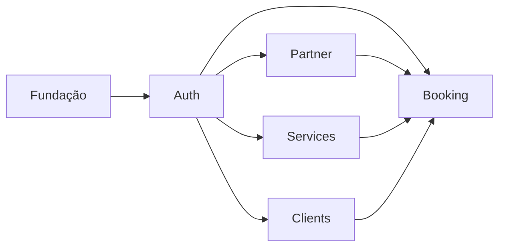

# Agenda Compartilhada — Tasks (MVP)

**Design**: `.specs/features/agenda-compartilhada/design.md`
**Spec**: `.specs/features/agenda-compartilhada/spec.md`
**Status:** ✅ Concluído (MVP)

---

## Estrutura no ClickUp

| Nível ClickUp | Organização | Exemplo |
|---------------|-------------|---------|
| **Lista** | Domínio | `Auth` |
| **Task** | Funcionalidade | `Backend — Autenticação JWT` |
| **Subtarefa** | Ação técnica | `Criar plugin do Fastify para ler JWT do cookie` |

Cada **Lista** (Domínio) contém tasks de backend e frontend da mesma funcionalidade. O setup inicial fica em uma seção **Fundação** separada.

---

## Dependências entre Domínios



**Regra:** Tasks de Fundação vêm primeiro. Auth é pré-requisito dos demais. Partner/Services/Clients podem rodar em paralelo após Auth. Booking depende de todos.

---

## Fundação do Projeto (Setup)

Tarefas de infraestrutura inicial: monorepo, containers, banco, esqueletos do Fastify e Nuxt.

### FOUNDATION-01: Inicializar monorepo

**Subtarefas:**
- [ ] Criar estrutura `api/` + `web/` na raiz
- [ ] Configurar `package.json` raiz com scripts compartilhados
- [ ] Configurar `tsconfig.json` raiz com paths
- [ ] Configurar `.gitignore`, `.env.example`
- [ ] Configurar Biome na raiz (lint + format) com scripts
- [ ] Validar compilação em ambos subprojetos

---

### FOUNDATION-02: Configurar Docker Compose

**Subtarefas:**
- [ ] Criar `docker-compose.yml` com 4 serviços: db (postgres), backend (Fastify), frontend (Nuxt), evolution-api
- [ ] Criar `Dockerfile` para `api/`
- [ ] Criar `Dockerfile` para `web/`
- [ ] Configurar redes, volumes e variáveis de ambiente
- [ ] Validar `docker-compose up` sobe todos os containers

---

### FOUNDATION-03: Esqueleto Fastify

**Subtarefas:**
- [ ] Inicializar `api/package.json` (fastify, @fastify/cookie, @fastify/cors, postgres.js, drizzle-orm, etc.)
- [ ] Criar entry point (`api/src/index.ts`) com inicialização do servidor (porta 3001)
- [ ] Configurar plugins globais (CORS, Cookie, Logger)
- [ ] Implementar error handler global (JSON padronizado)
- [ ] Adicionar health check `GET /api/health`
- [ ] Configurar variáveis de ambiente com Zod

---

### FOUNDATION-04: Esqueleto Nuxt

**Subtarefas:**
- [ ] Inicializar `web/package.json` (nuxt, vuetify-nuxt-module, @nuxtjs/tailwindcss, pinia, dayjs, etc.)
- [ ] Configurar `nuxt.config.ts` com modules e routeRules (`/` SSR, `/dashboard/**` SPA, `/agendar/**` SPA)
- [ ] Configurar Vuetify 3 com tema customizado
- [ ] Configurar TailwindCSS (landing page)
- [ ] Validar `npm run dev` inicia o servidor na porta 3000

---

### FOUNDATION-05: Configurar Drizzle + PostgreSQL

**Subtarefas:**
- [ ] Configurar `postgres.js` com `prepare: true` em `api/src/db/index.ts`
- [ ] Configurar `drizzle.config.ts`
- [ ] Criar migration inicial (vazia) e validar execução
- [ ] Criar script de seed (`api/src/db/seed.ts`) com conta OWNER admin
- [ ] Rodar seed e validar no banco

---

## Domínio: Auth

Fluxo completo de autenticação: schema de profissionais (apenas o necessário para login), JWT com cookies, RBAC, tela de login, store de usuário e proteção de rotas.

### AUTH-01: Backend — Schema de professionals (campos de auth) ✅

**Subtarefas:**
- [x] Criar no Drizzle a tabela `professionals` (id serial, name, cpf, phone, passwordHash, role ENUM, isActive, createdAt, updatedAt)
- [x] Criar Zod schemas de validação (telefone com normalize, CPF)
- [x] Gerar migration e aplicar
- [x] Adicionar índices únicos em cpf e phone

---

### AUTH-02: Backend — Rotas de autenticação ✅

**Subtarefas:**
- [x] Estruturar módulo Fastify `api/src/modules/auth/` com routes + service + schema
- [x] Implementar `POST /api/auth/login` (valida telefone normalizado + bcrypt, gera tokens)
- [x] Implementar `POST /api/auth/refresh` (valida refresh_token, emite novos tokens)
- [x] Implementar `POST /api/auth/logout` (limpa cookies)
- [x] Configurar cookies HttpOnly, SameSite, Secure (prod)
  - access_token: 15 min
  - refresh_token: 30 dias

---

### AUTH-03: Backend — JWT plugin + middleware de autorização ✅

**Subtarefas:**
- [x] Criar plugin Fastify que decodifica JWT do cookie `access_token`
- [x] Injetar `request.user` com `{ professionalId, role }` em todas as rotas
- [x] Criar middleware `requireAuth` (verifica JWT → 401 se inválido/expirado)
- [x] Criar middleware `requireRole('OWNER')` (verifica role → 403 se negado)
- [x] Criar middleware `requireRole('OWNER', 'PARTNER')`

---

### AUTH-04: Backend — RBAC com CASL.js ✅

**Subtarefas:**
- [x] Instalar `@casl/ability`
- [x] Implementar fábrica `createAbility(role, professionalId)` com AbilityBuilder
- [x] **OWNER:** `can('manage', 'all')`
- [x] **PARTNER:**
  - `can('read', 'Appointment')` (vê horários ocupados de todas)
  - `can(['create','update','cancel','setStatus'], 'Appointment', { professionalId: ownId })`
  - `can('read', 'Client')`
  - `can(['read','create','update','delete'], 'Service', { professionalId: ownId })`
  - `can(['read','update'], 'Professional', { id: ownId })`
  - `can(['read','create','delete'], 'Block', { professionalId: ownId })`
- [x] Integrar ability nos services (service layer oculta `price` se `professionalId !== ownId`) — *pendente implementação dos services*

---

### AUTH-05: Frontend — Tela de login ✅

**Subtarefas:**
- [x] Criar página `/login` com formulário (telefone + senha)
- [x] Criar componente `PhoneInput` com máscara (XX) XXXXX-XXXX — *embutido inline na página*
- [x] Criar utility `web/utils/phone.ts` (mask, unmask, normalize)
- [x] Validar formulário com Zod
- [x] Exibir erro genérico para credenciais inválidas
- [x] Redirecionar para `/dashboard/agenda` após login

---

### AUTH-06: Frontend — Store de auth + proteção de rotas ✅

**Subtarefas:**
- [x] Criar store Pinia `auth` (`user`, `isAuthenticated`, `role`, `login()`, `logout()`, `refreshToken()`)
- [x] Criar plugin Nuxt que intercepta 401, chama refresh, repete requisição — *embutido em `web/utils/api.ts`*
- [x] Criar middleware `auth` (redireciona para `/login` se não autenticado)
- [ ] Criar middleware `owner` (redireciona se role não for OWNER) — *pendente*
- [x] Criar wrapper API `web/utils/api.ts` (get, post, put, patch, delete com base URL)
- [ ] Componente `ConfirmDialog` reutilizável — *pendente*

---

## Domínio: TanStack Query (Server State)

Configuração do TanStack Query no frontend para gerenciar estado do servidor, com SSR hydration e composables por domínio.

### TANSTACK-01: Frontend — Plugin Vue Query com SSR hydration

**Subtarefas:**
- [x] Instalar `@tanstack/vue-query`
- [x] Criar `web/plugins/vue-query.ts` com QueryClient isolado por requisição SSR
- [x] Implementar dehydrate no hook `app:rendered`
- [x] Implementar hydrate no hook `app:created`

### TANSTACK-02: Frontend — Composables de domínio

**Subtarefas:**
- [x] Criar `web/composables/use-appointments.ts` — `useAppointments(date)`, `useAppointmentsByProfessional(date, professionalId)`
- [x] Criar `web/composables/use-user-profile.ts` — `useUserProfile(userId)`
- [x] Criar `web/composables/use-services.ts`
- [x] Criar `web/composables/use-clients.ts`

### TANSTACK-03: Frontend — Integração com Pinia auth store

**Subtarefas:**
- [x] `useAuthStore.logout()` chama `queryClient.clear()` para limpar cache
- [x] API wrapper (`web/utils/api.ts`) faz refresh automático em 401
- [x] SSE events invalidam queries do TanStack Query (via BOOKING-05)

### TANSTACK-04: Frontend — SSR prefetch pattern

**Subtarefas:**
- [x] Implementar `useAsyncData` + `queryClient.prefetchQuery` na página `dashboard/agenda.vue`
- [x] Plugin dehydrate/hydrate captura e restaura o estado automaticamente
- [ ] Aplicar pattern nas demais páginas SSR — *pendente*

---

## Domínio: Partner

Gestão completa de profissionais parceiras: schema estendido, CRUD completo, ativação/desativação, edição de horário de trabalho, bloqueios de agenda.

### PARTNER-01: Backend — Schema de professionals (completo)

**Subtarefas:**
- [ ] Estender schema do domínio Auth: adicionar campos `workHoursStart`, `workHoursEnd` (default 08:00, 20:00)
- [ ] Gerar migration e aplicar

---

### PARTNER-02: Backend — CRUD de profissionais

**Subtarefas:**
- [ ] Estruturar módulo Fastify `api/src/modules/partner/`
- [ ] Implementar `GET /api/professionals` (OWNER: todas; PARTNER: só própria)
- [ ] Implementar `POST /api/professionals` (OWNER only — cria profissional)
- [ ] Implementar `PUT /api/professionals/:id` (OWNER: qualquer campo; PARTNER: só nome, phone, workHours)
- [ ] Implementar `PATCH /api/professionals/:id/toggle-active` (OWNER only)
- [ ] Aplicar middlewares `requireAuth` + verificação RBAC
- [ ] Validar CPF e telefone únicos

---

### PARTNER-03: Backend — CRUD de bloqueios de agenda

**Subtarefas:**
- [ ] Estruturar módulo Fastify `api/src/modules/partner/blocks/`
- [ ] Criar tabela `blocks` no Drizzle (id UUID, professionalId FK, startTime, endTime, reason, timestamps)
- [ ] Gerar migration e aplicar
- [ ] Implementar `GET /api/blocks?professional_id=&start=&end=`
- [ ] Implementar `POST /api/blocks` (OWNER: qualquer; PARTNER: só próprio)
- [ ] Implementar `DELETE /api/blocks/:id` (sem soft delete)
- [ ] Atalho "dia inteiro" (00:00-23:45)
- [ ] **Validação EDGE-02:** overlap com block existente → warning
- [ ] **Validação EDGE-03:** overlap com appointment ativo → warning (não bloqueia)

---

### PARTNER-04: Frontend — Tela de gestão de profissionais

**Subtarefas:**
- [ ] Criar página `/dashboard/profissionais` (OWNER only — acesso negado para PARTNER)
- [ ] Listar profissionais com status (ativo/inativo)
- [ ] Modal de criação com campos (nome, CPF, telefone, senha, horário início/fim)
- [ ] Modal de edição (campos permitidos por role)
- [ ] Botão ativar/desativar com confirmação
- [ ] PARTNER vê apenas card próprio para editar nome, telefone e horários

---

### PARTNER-05: Frontend — Bloqueios de agenda

**Subtarefas:**
- [ ] Criar formulário `BlockForm` (data, hora início, hora fim, atalho "dia inteiro", razão opcional)
- [ ] Integrar no calendário do dashboard (domínio Booking)
- [ ] Bloqueios aparecem visualmente distintos (cinza/riscado) no WeeklyCalendar
- [ ] Exibir warning se houver appointments conflitantes

---

## Domínio: Services

Catálogo de serviços oferecidos pelas profissionais: cadastro, edição, exclusão (soft delete), vínculo com parceiras, definição de preço e duração.

### SERVICES-01: Backend — Schema de services

**Subtarefas:**
- [ ] Criar tabela `services` no Drizzle (id UUID, professionalId FK, name, durationMinutes, price DECIMAL(10,2), description, isActive, timestamps)
- [ ] Gerar migration e aplicar
- [ ] Adicionar índice em professionalId

---

### SERVICES-02: Backend — CRUD de serviços

**Subtarefas:**
- [ ] Estruturar módulo Fastify `api/src/modules/services/`
- [ ] Implementar `GET /api/services?professional_id=` (OWNER: todas; PARTNER: só próprias)
- [ ] Implementar `POST /api/services` (OWNER: qualquer professional; PARTNER: só próprio)
- [ ] Implementar `PUT /api/services/:id` (mesma regra de RBAC)
- [ ] Implementar `DELETE /api/services/:id` (soft delete `isActive=false` se houver appointments vinculados; físico se não)
- [ ] Aplicar middlewares `requireAuth` + verificação RBAC

---

### SERVICES-03: Frontend — Tela de gestão de serviços

**Subtarefas:**
- [ ] Criar página `/dashboard/servicos` com listagem de serviços
- [ ] OWNER vê serviços de todas as profissionais; PARTNER vê só próprios
- [ ] Modal de criação: nome, duração (minutos), valor (R$), descrição, profissional (só OWNER)
- [ ] Modal de edição (campos permitidos por role)
- [ ] Exclusão com confirmação (aviso se houver agendamentos vinculados)

---

## Domínio: Clients

Base de clientes do salão: cadastro, busca, histórico de atendimentos. Compartilhado entre todas as profissionais.

### CLIENTS-01: Backend — Schema de clients

**Subtarefas:**
- [ ] Criar tabela `clients` no Drizzle (id UUID, name, phone unique, timestamps)
- [ ] Gerar migration e aplicar
- [ ] Índice único em phone

---

### CLIENTS-02: Backend — CRUD de clientes

**Subtarefas:**
- [ ] Estruturar módulo Fastify `api/src/modules/clients/`
- [ ] Implementar `GET /api/clients?q=` (busca por nome ou telefone — OWNER/PARTNER)
- [ ] Implementar `POST /api/clients` (OWNER only)
- [ ] Implementar `PUT /api/clients/:id` (OWNER only — correção de telefone)
- [ ] Implementar `GET /api/clients/:id/history` (OWNER: todos appointments; PARTNER: só próprios)
- [ ] Normalização de telefone (Zod transform) em todas as operações

---

### CLIENTS-03: Frontend — Tela de gestão de clientes

**Subtarefas:**
- [ ] Criar página `/dashboard/clientes` com listagem e campo de busca
- [ ] Implementar componente `ClientSearch` (autocomplete com debounce 300ms)
- [ ] Modal de criação (OWNER only — nome + telefone)
- [ ] Modal de edição (OWNER only — correção de telefone)
- [ ] Exibir histórico de atendimentos ao selecionar cliente
- [ ] PARTNER vê lista e histórico (apenas próprios atendimentos) sem botões de criar/editar

---

## Domínio: Booking

Coração do sistema: agendamentos, tempo real SSE, calendário do dashboard, landing page, fluxo de autoatendimento do cliente e verificação WhatsApp.

### BOOKING-01: Backend — Schema de appointments

**Subtarefas:**
- [ ] Criar tabela `appointments` no Drizzle (id UUID, professionalId FK, clientId FK, serviceId FK, startTime, endTime, status ENUM, notes, cancelledBy FK, timestamps)
- [ ] Gerar migration e aplicar
- [ ] Índices em professionalId + startTime

---

### BOOKING-02: Backend — CRUD de agendamentos

**Subtarefas:**
- [ ] Estruturar módulo Fastify `api/src/modules/booking/appointments/`
- [ ] Implementar `GET /api/appointments?professional_id=&start=&end=`
- [ ] Service layer oculta `price` quando PARTNER vê appointment de outra
- [ ] Implementar `POST /api/appointments` (calcula `endTime = startTime + service.durationMinutes`)
- [ ] Implementar `PUT /api/appointments/:id` (OWNER: qualquer; PARTNER: só próprio)
- [ ] **Validação EDGE-07:** `startTime < now` → 422, permite apenas alteração de status
- [ ] Aplicar RBAC em todas as rotas

---

### BOOKING-03: Backend — Transação com checagem de conflito

**Subtarefas:**
- [ ] Envolver `POST /api/appointments` em `db.transaction()`
- [ ] SELECT appointments (`status != cancelled`) + blocks conflitantes no período
- [ ] Conflito → ROLLBACK + 409 + sugestões de horários alternativos
- [ ] Livre → INSERT + COMMIT

---

### BOOKING-04: Backend — Cancelar e alterar status

**Subtarefas:**
- [ ] Implementar `PATCH /api/appointments/:id/cancel` (OWNER: qualquer; PARTNER: só próprio)
- [ ] Agendamento passado: mantém horário ocupado (status = cancelled, não reabre)
- [ ] Agendamento futuro: libera horário
- [ ] Implementar `PATCH /api/appointments/:id/status` (completed / no_show)
- [ ] Status `cancelled` não pode ser alterado

---

### BOOKING-05: Backend — SSE (tempo real)

**Subtarefas:**
- [ ] Implementar endpoint `GET /api/sse` (autenticado via cookie, `text/event-stream`)
- [ ] Implementar SSE event emitter singleton (mapa `professionalId → Set<connections>`)
- [ ] Heartbeat a cada 30s
- [ ] Emitir eventos: `appointment.created`, `appointment.updated`, `appointment.cancelled`, `block.created`, `block.deleted`
- [ ] OWNER recebe eventos de todas as profissionais
- [ ] Cleanup de conexões fechadas

---

### BOOKING-06: Backend — Envio e verificação de código WhatsApp

**Subtarefas:**
- [ ] Criar tabela `verification_codes` no Drizzle (id UUID, phone, code, expiresAt, usedAt, timestamps)
- [ ] Integrar EvolutionAPI (config via env vars: URL, API key)
- [ ] Implementar `POST /api/booking/send-code` (gera código 6 dígitos, TTL 10min, cooldown 60s, envia WhatsApp)
- [ ] Implementar `POST /api/booking/verify-code` (valida, marca usado, emite token efêmero em cookie)
- [ ] EvolutionAPI offline → log + 503 ("Serviço temporariamente indisponível"), não trava sistema

---

### BOOKING-07: Backend — Listagens públicas do booking

**Subtarefas:**
- [ ] Implementar `GET /api/booking/professionals` (isActive=true, sem auth) → id, name, workHours
- [ ] Implementar `GET /api/booking/professionals/:id/services` (isActive=true, sem auth) → id, name, durationMinutes, price, description
- [ ] Implementar `GET /api/booking/available-slots?professional_id=&date=&service_id=` (service_id obrigatório)
- [ ] Algoritmo: range workHours - appointments - blocks, step = durationMinutes, intervalo 15min
- [ ] Retornar array `[{ start, end }]`

---

### BOOKING-08: Backend — Criação e cancelamento pelo cliente

**Subtarefas:**
- [ ] Implementar `POST /api/booking/appointments` (token efêmero do cookie)
- [ ] Buscar cliente por telefone: se existe → vincula; se não → cria
- [ ] Re-checar disponibilidade (pode ter mudado) → 409 com alternativas
- [ ] Emitir SSE `appointment.created`
- [ ] Implementar `POST /api/booking/appointments/lookup` com `{ phone }` → lista futuros do cliente
- [ ] Implementar `POST /api/booking/appointments/:id/cancel` com `{ phone }`
- [ ] Validar `startTime > now` → senão "Agendamento já realizado"
- [ ] Emitir SSE `appointment.cancelled`

---

### BOOKING-09: Frontend — Landing page (SSR)

**Subtarefas:**
- [ ] Criar página `/` com renderização SSR (SEO)
- [ ] Seções: Hero, Serviços, Sobre, Contato
- [ ] Estilizar com TailwindCSS
- [ ] Link "Agende seu horário" → `/agendar`
- [ ] Link "Área da Profissional" → `/login`

---

### BOOKING-10: Frontend — Store de booking

**Subtarefas:**
- [ ] Criar store Pinia `booking` (step, phone, verified, selectedProfessional, selectedService, selectedSlot, appointments)
- [ ] Actions: sendCode, verifyCode, fetchProfessionals, fetchServices, fetchSlots, confirmAppointment, lookupAppointments, cancelAppointment

---

### BOOKING-11: Frontend — Fluxo de autoatendimento (multi-step)

**Subtarefas:**
- [ ] Página `/agendar` — PhoneInput (envia código WhatsApp)
- [ ] Página `/agendar/verify` — input 6 dígitos + reenviar (cooldown 60s)
- [ ] Página `/agendar/profissional` — lista profissionais ativas
- [ ] Página `/agendar/servico` — lista serviços (nome, duração, valor)
- [ ] Página `/agendar/horario` — calendário com slots disponíveis
- [ ] Página `/agendar/confirmar` — resumo + confirmar
- [ ] Tratar erro 409: exibir alternativas
- [ ] Tela de confirmação pós-agendamento

---

### BOOKING-12: Frontend — Meus agendamentos (cliente)

**Subtarefas:**
- [ ] Página `/agendar/meus-agendamentos` — campo de telefone
- [ ] Listar appointments futuros do cliente
- [ ] Botão cancelar com ConfirmDialog
- [ ] "Nenhum agendamento encontrado" se lista vazia
- [ ] "Agendamento já realizado" se tentar cancelar passado

---

### BOOKING-13: Frontend — Calendário do dashboard

**Subtarefas:**
- [ ] Criar componente `WeeklyCalendar` (Vuetify v-calendar, slots 15min, eventos coloridos por profissional)
- [ ] Criar store Pinia `calendar` (currentWeekStart, appointments, blocks, professionalFilter, fetchWeek, navigateWeek)
- [ ] Criar composable `useSSE` (EventSource, dispatch para stores, reconnect com backoff)
- [ ] Criar `NotificationBadge` (sino com contagem via SSE)
- [ ] Criar modal `AppointmentForm` (cliente search + serviço dropdown + data/hora)
  - OWNER: pode selecionar qualquer profissional
  - PARTNER: fixo na própria
- [ ] Click em slot → criar; click em evento → editar/cancelar
- [ ] SSE atualiza calendário em tempo real

---

### BOOKING-14: Frontend — Páginas do dashboard

**Subtarefas:**
- [ ] Criar página `/dashboard/agenda` com WeeklyCalendar + AppointmentForm + BlockForm
- [ ] Criar página `/dashboard/financeiro` (OWNER only — visão agregada)
- [ ] Criar layout do dashboard (menu lateral, header, NotificationBadge)
- [ ] Navegação entre páginas do dashboard

---

## Resumo para ClickUp

| Lista (Domínio) | Tasks | Subtarefas totais |
|-----------------|-------|-------------------|
| **Fundação** | FOUNDATION-01 a 05 | ~25 |
| **Auth** | AUTH-01 a 06 | ~30 |
| **Partner** | PARTNER-01 a 05 | ~25 |
| **Services** | SERVICES-01 a 03 | ~15 |
| **Clients** | CLIENTS-01 a 03 | ~15 |
| **Booking** | BOOKING-01 a 14 | ~70 |
| **Total** | **36 tasks** | **~180 subtarefas** |

### Mapa de dependências entre tasks

```
FOUNDATION-01 → FOUNDATION-02
FOUNDATION-01 → FOUNDATION-03
FOUNDATION-01 → FOUNDATION-04
FOUNDATION-03 → FOUNDATION-05
FOUNDATION-04 → (frontend tasks)

FOUNDATION-05 → AUTH-01
AUTH-01 → AUTH-02 → AUTH-03 → AUTH-04
AUTH-02 → AUTH-05 → AUTH-06

AUTH-04 → PARTNER-01 → PARTNER-02 → PARTNER-03
AUTH-06 → PARTNER-04 → PARTNER-05

AUTH-04 → SERVICES-01 → SERVICES-02
AUTH-06 → SERVICES-03

AUTH-04 → CLIENTS-01 → CLIENTS-02
AUTH-06 → CLIENTS-03

AUTH-04 → BOOKING-01 → BOOKING-02 → BOOKING-03 → BOOKING-04
AUTH-03 → BOOKING-05
AUTH-04 → BOOKING-05
FOUNDATION-02 → BOOKING-06
BOOKING-02 → BOOKING-07 → BOOKING-08
AUTH-06 → BOOKING-09
AUTH-06 → BOOKING-10 → BOOKING-11 → BOOKING-12
PARTNER-04 → BOOKING-13
PARTNER-05 → BOOKING-13
SERVICES-03 → BOOKING-13
CLIENTS-03 → BOOKING-13
BOOKING-05 → BOOKING-13
BOOKING-13 → BOOKING-14
```

Tasks que não compartilham dependências entre si podem rodar em paralelo (ex: PARTNER-02, SERVICES-02 e CLIENTS-02 podem ser implementados simultaneamente).
