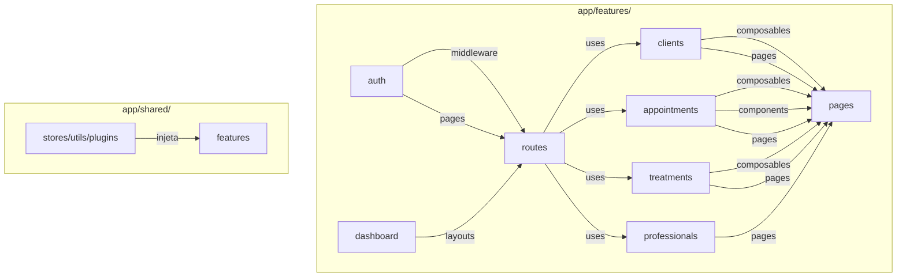

# Dashboard DDD Restructuring Design

**Spec**: `.specs/features/dashboard-restructuring/spec.md`
**Status**: Draft

---

## Architecture Overview

Reorganização do `packages/dashboard` de estrutura plana por tipo para estrutura DDD por domínio, mantendo compatibilidade com Nuxt 4 conventions e auto-imports.



---

## Code Reuse Analysis

### Arquivos Existentes a Migrar

| Arquivo Original | Novo Local | Tipo |
|-----------------|------------|------|
| `app/stores/auth.ts` | `features/auth/stores/auth.ts` | store |
| `app/middleware/auth.ts` | `features/auth/middleware/auth.ts` | middleware |
| `app/pages/login.vue` | `features/auth/pages/login.vue` | page |
| `app/composables/use-clients.ts` | `features/clients/composables/use-clients.ts` | composable |
| `app/pages/dashboard/clientes.vue` | `features/clients/pages/clientes.vue` | page |
| `app/composables/use-appointments.ts` | `features/appointments/composables/use-appointments.ts` | composable |
| `app/pages/dashboard/agenda.vue` | `features/appointments/pages/agenda.vue` | page |
| `app/features/dashboard/components/AppointmentsCard.vue` | `features/appointments/components/AppointmentsCard.vue` | component |
| `app/composables/use-services.ts` | `features/treatments/composables/use-treatments.ts` | composable |
| `app/pages/dashboard/servicos.vue` | `features/treatments/pages/servicos.vue` | page |
| `app/pages/dashboard/profissionais.vue` | `features/professionals/pages/profissionais.vue` | page |
| `app/pages/index.vue` | `features/dashboard/pages/index.vue` | page |
| `app/layouts/dashboard.vue` | `features/dashboard/layouts/dashboard.vue` | layout |

### Utilitários Compartilhados

| Arquivo | Local | Mantém |
|---------|-------|--------|
| `app/stores/layout.ts` | `shared/stores/layout.ts` | - |
| `app/utils/api.ts` | `shared/utils/api.ts` | - |
| `app/utils/phone.ts` | `shared/utils/phone.ts` | - |
| `app/plugins/vue-query.ts` | `shared/plugins/vue-query.ts` | - |
| `app/composables/use-sse.ts` | `shared/composables/use-sse.ts` | - |
| `app/composables/use-user-profile.ts` | `shared/composables/use-user-profile.ts` | - |

---

## Tech Decisions

| Decisão | Escolha | Rationale |
|---------|---------|-----------|
| Estrutura features/ | `app/features/{domain}/` | Nuxt 4 compatibility com `future.compatibilityVersion: 4` |
| Auto-imports em subpastas | Configurar `dirs.composables/stores` no nuxt.config | Necessário para Nuxt encontrar composables fora de ~/composables |
| Components path | Adicionar `~/features/*/components` aos dirs | Componentes em features precisam ser descobertos |
| Pages dentro de features | `features/{domain}/pages/` | Mantém coesão DDD (pages ficam em `~/pages/` por convenção Nuxt) |
| Layouts dentro de features | `features/dashboard/layouts/` | Layout é específico do domínio dashboard |

---

## nuxt.config.ts Updates

```typescript
export default defineNuxtConfig({
  future: {
    compatibilityVersion: 4,
  },
  dir: {
    app: 'app',
    features: 'features',
  },
  components: [
    { path: '~/components', pathPrefix: false },
    { path: '~/features/*/components', pathPrefix: false },
  ],
  modules: ['@pinia/nuxt', '@nuxt/ui'],
  // Nuxt 4 auto-discovers: composables, stores (via pinia), utils, middleware
  // from ~/ and subdirs. Precisamos adicionar paths de features:
  pinia: {
    storesDirs: ['~/stores/**', '~/features/*/stores/**'],
  },
})
```

**Nota**: Nuxt 4 com `future.compatibilityVersion: 4` muda o srcDir default para `{appDir}/app`. Precisamos verificar se `~/features` será resolvido corretamente.

---

## Riscos e Mitigações

| Risco | Mitigação |
|-------|-----------|
| Auto-imports não funcionam | Testar incrementalmente por domínio |
| Pages não descobertas | Verificar configuração de `srcDir` e `features` dir |
| Imports quebrados | Usar `nuxi prepare` antes de testar |

---

## Verificação

- [ ] `npm run dev` inicia sem erros
- [ ] Todas as páginas acessíveis via rota
- [ ] Composables funcionam via auto-import
- [ ] `npm run typecheck` passa